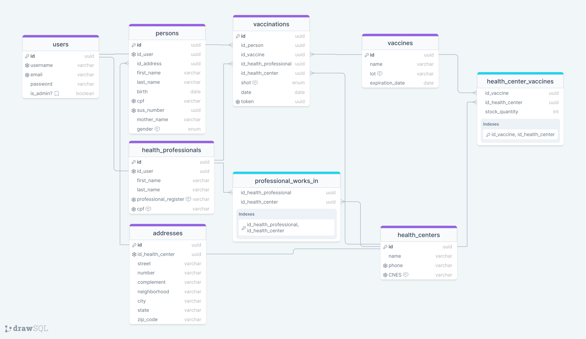

# VaccinationApi
A Vaccination API with the main entities: persons, health_professionals, vaccines, vaccinations, and health_centers. 
This project simulates a system for applying and storing information about vaccinations. For this, we have two roles: persons and health_professionals, each one with your own authentication rules and permission levels. The technology used to implement this was [Guardian](https://hexdocs.pm/guardian/Guardian.html).
One faced challenge was implementing the processing of many vaccinations simultaneously because not handling this case could crash the database. For this, [Oban](https://hexdocs.pm/oban/Oban.html) was used, a flexible library that can handle a wide range of background jobs.

## The Database Model

[Vaccination API Database Model](https://drawsql.app/teams/vucu/diagrams/vaccination)

## Technologies
  - [Elixir](https://elixir-lang.org/)
  - [Phoenix](https://www.phoenixframework.org/)
  - [Ecto](https://hexdocs.pm/ecto/Ecto.html)
  - [Oban](https://hexdocs.pm/oban/Oban.html)
  - [Guardian](https://hexdocs.pm/guardian/Guardian.html)
  - [Phoenix Swagger](https://hexdocs.pm/phoenix_swagger/getting-started.html)
  - [Postgres](https://www.postgresql.org/)
  - [Docker](https://www.docker.com/)
  - [Docker compose](https://docs.docker.com/compose/)

## Install and Run
- You must have Docker and Docker Compose installed
- Run `source .env`
- Run `./_scripts/dev.sh`
- Install the dependencies: `mix deps.get` 
- Compile the dependencies: `mix deps.compile`
- Run the server: `make app` or `iex -S mix phx.server`
- Visit Swagger Page http://localhost:4000/swagger

## Insomnia
- Use `insomnia.json` to configure the routes
- {
	"base_url": "http://127.0.0.1:4000",
	"token": "Response → Body Attribute"
}
Configure the token response:
- Request: [Auth] POST user login
- Filter (JSONPath or XPath): $data.token
- Trigger Behavior: Always - resend request when needed 

# TO DO
- [ ] Implement the roles and permissions system for Persons and Health Professionals
- [ ] Protect endpoints with permission levels
- [ ] Create an endpoint to validate vaccination token
- [ ] Handle vaccine stock from Health Center when register a vaccination (decrease stock)
- [ ] Check if Health Center has stock of the vaccine before register vaccination 
- [ ] Check if the Health Professional works at the Healh Center before register the Vaccination
- [ ] Add Address entity and relationships